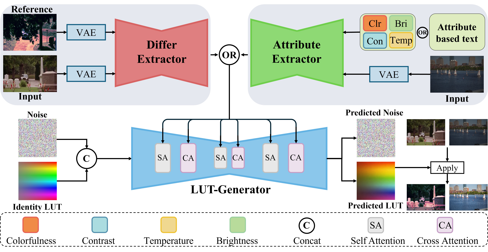
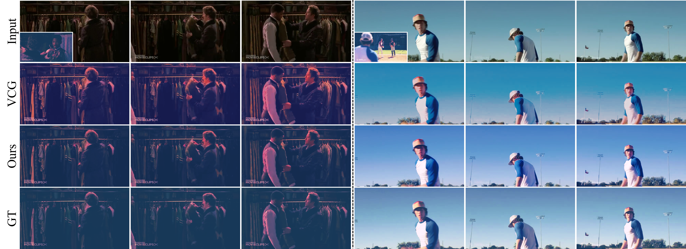
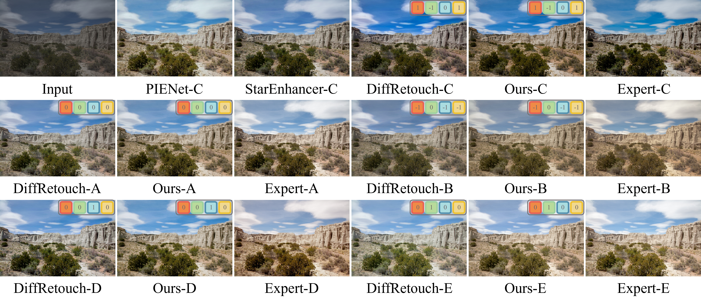
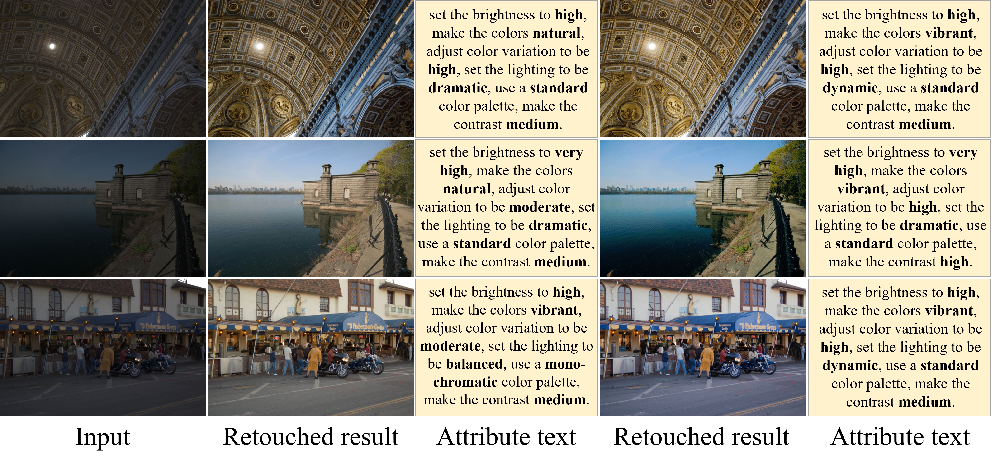

# UniLUT: A Unified Multi-Reference Framework for Image and Video Retouching
> **Abstract:** Personalized retouching of images and videos demands flexible user control while preserving strong visual coherence and temporal consistency (for videos). Existing video style transfer methods largely rely on exemplar-based guidance, whereas recent image retouching techniques support more diverse modalities, including reference images, attribute vectors, and attribute-based text descriptions. However, most previous approaches are restricted to a single type of guidance and lack a unified model capable of handling multiple types of guidance across both images and videos. In this work, we propose UniLUT, a unified retouching framework that handles different types of guidance, including reference images, attribute vectors, and attribute-based text descriptions, within a shared architecture for image and video retouching. Beyond unifying different guidance, we formulate retouching as explicit residual 3D lookup table (LUT) prediction and introduce a dedicated LUT branch to directly model global color transformations. With task-aligned supervision, our method improves LUT prediction quality and retouching fidelity, producing faithful color transformations while preserving structural details. Extensive experiments on the Condensed Movie and MIT-Adobe FiveK datasets demonstrate that UniLUT achieves competitive or superior performance compared with state-of-the-art methods.

---

## Overall

---

## 🔎 Results

Qualitative and Quantitative Results

- Qualitative results on the Condensed Movie dataset using image references

  

- Qualitative results on the MIT-Adobe FiveK dataset using attribute references

  

- Qualitative results on the MIT-Adobe FiveK dataset using text references

  

- Quantitative results on the Condensed Movie dataset

  

- Quantitative results on the MIT-Adobe FiveK dataset

  

---

## 💡 Acknowledgements

This project is based on [VideoColorGrading](https://github.com/seunghyuns98/VideoColorGrading).
